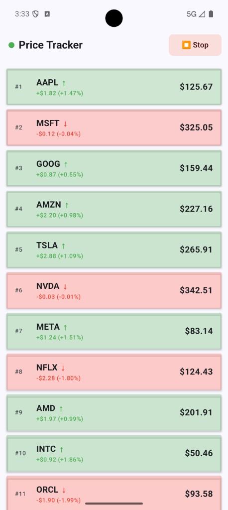
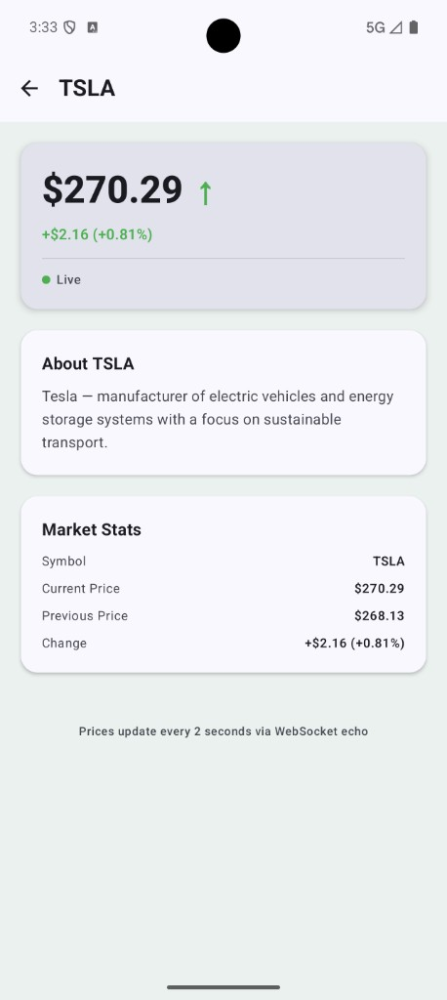

# Real-Time Price Tracker (Android)

Android app that shows live price updates for 25 stock symbols. Uses **Jetpack Compose**, **Navigation Compose** (feed + symbol details), and a **WebSocket echo** server; updates every 2 seconds.

---

## Screenshots

| Feed | Detail |
|------|--------|
|  |  |

---

## What it does

- **Feed screen:** Scrollable list of 25 symbols (e.g. AAPL, GOOG, TSLA) with current price and green ↑ / red ↓ change. Top bar: connection dot (green/red/orange) and **Start / Stop** button. Tap a row → Symbol details.
- **WebSocket:** Connects to `wss://ws.postman-echo.com/raw`. Every 2 seconds sends a random price per symbol, receives echo, updates UI.
- **Detail screen:** Selected symbol as title, current price with ↑/↓, short description, market stats, connection status. Deep link: `stocks://symbol/AAPL`.

---

## Challenge requirements (done)

**Objective:** Android app with Jetpack Compose for real-time price updates for multiple symbols and a second screen for symbol details using Navigation Compose with a NavHost. ✅

### Core features

- **Live price tracking:** 25 stock symbols (AAPL, GOOG, TSLA, AMZN, MSFT, NVDA, etc.), list long and scrollable. ✅
- **WebSocket echo:** Connects to `wss://ws.postman-echo.com/raw`. Every 2 seconds, per symbol: generate random price update → send to server → receive echoed message → update symbol data in UI. ✅
- **Feed screen (LazyColumn):** One row per symbol; each row shows symbol name, current price, price change indicator (green ↑ / red ↓); list sorted by price (highest at top); tap row opens Symbol Details. ✅
- **Top bar (Feed):** Left = connection status (🟢 connected / 🔴 disconnected / orange connecting); Right = Start / Stop toggle for the price feed. ✅
- **Symbol details screen:** Selected symbol as title; current price with ↑/↓ (same logic as feed); description about the symbol; plus market stats and connection status. ✅

### Technical expectations

- 100% Jetpack Compose UI. ✅
- Architecture: MVI (Model–View–Intent). ✅
- Navigation Compose with NavHost, two destinations: **feed** (start), **symbol details**. ✅
- Kotlin Flow for WebSocket data streams. ✅
- Immutable UI state and clean separation of concerns. ✅
- ViewModels for Feed and Detail. ✅
- StateFlow for UI state. ✅
- SavedStateHandle for the selected symbol on the details screen. ✅
- Single WebSocket stream so both screens observe updates without duplicate connections. ✅

### Bonus (optional)

- Price flashes green ~1s on increase, red ~1s on decrease. ✅
- Compose UI tests and unit tests. ✅
- Light and dark themes (Material 3). ✅
- Deep link `stocks://symbol/{symbol}` opens the details screen. ✅

### Deliverables

- Source code with progressive commit history. ✅
- Clean, well-structured README.md. ✅

---

## Tech

- **UI:** Jetpack Compose (Material 3, light/dark).
- **Architecture:** MVI; ViewModels; `StateFlow`; single WebSocket stream shared by feed and detail.
- **Navigation:** NavHost with `feed` and `detail/{symbol}`; `SavedStateHandle` for symbol.
- **Modules:** `app` (UI, Hilt), `domain` (use cases, models), `data` (WebSocket, repository).

---

## How to run

```bash
git clone <repo-url>
cd MultibankPriceTracker
./gradlew installDebug
```

Then run on an emulator or device from Android Studio or `./gradlew installDebug`.

- **Unit tests:** `./gradlew test`
- **Coverage:** `./gradlew testCoverage` → reports in `*/build/reports/jacoco/...`
- **UI tests:** `./gradlew connectedDebugAndroidTest` (device/emulator required)

---

## Deep link

Open details for a symbol:

```bash
adb shell am start -a android.intent.action.VIEW -d "stocks://symbol/NVDA"
```

---

## License

For coding challenge / portfolio use.
